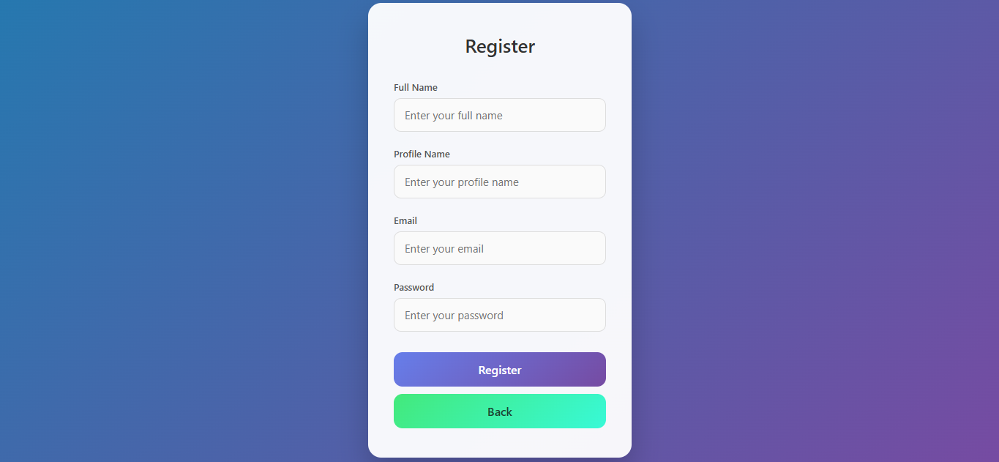

# 🔐 Express Login & Register App

This is a simple **Login & Register application** built using **Node.js, Express.js, and EJS**.  
The project demonstrates basic authentication logic using in-memory user data and EJS templates.

---

## 🚀 Features

- User Login
- User Registration
- Form handling using `express.urlencoded()`
- Server-side rendering with **EJS**
- Static CSS support
- Simple authentication logic
- Redirect handling

---

## 🛠️ Tech Stack

- **Node.js**
- **Express.js**
- **EJS (Embedded JavaScript Templates)**
- **HTML & CSS**

---

## 📂 Project Structure

