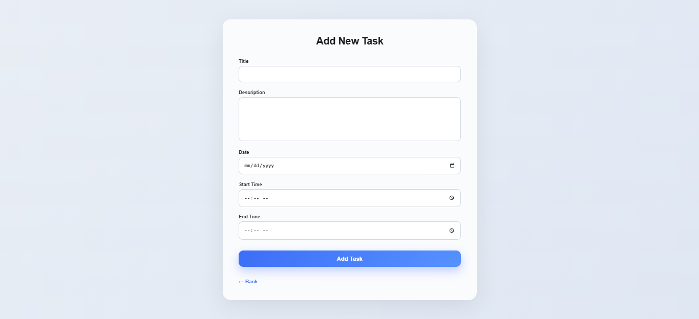

# 📝 Task Manager App (Express + EJS)

This is a simple **Task Manager / To-Do Application** built using **Node.js, Express.js, and EJS**.  
Users can **add, view, edit, and delete tasks**.  
All tasks are stored in **memory (array)** for learning purposes.

---

## 🚀 Features

- Add New Task
- View All Tasks
- Edit Existing Task
- Delete Task
- EJS based UI rendering
- Form handling using Express
- Simple CRUD operations

---

## 🛠️ Tech Stack

- **Node.js**
- **Express.js**
- **EJS (Embedded JavaScript Templates)**
- **HTML & CSS**

---

## 📂 Project Structure

