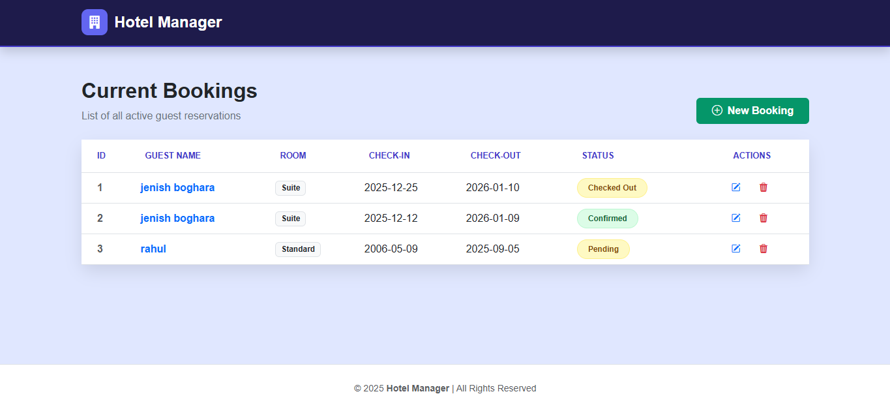
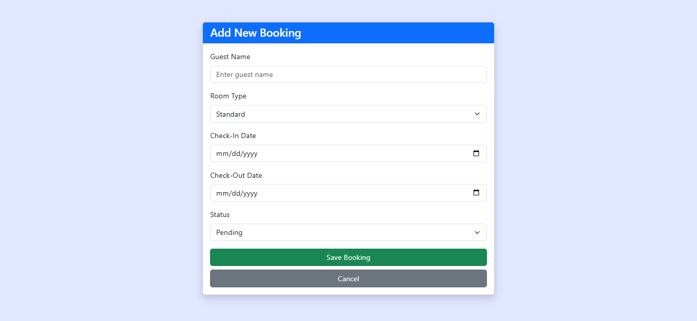
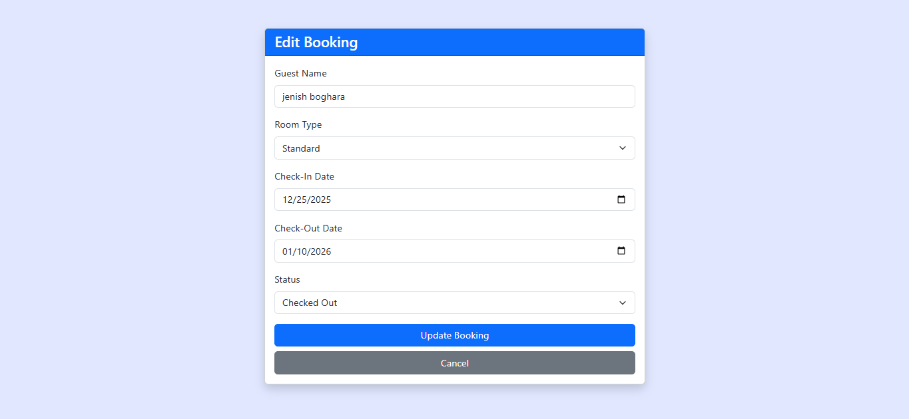

# 🏨 Hotel Manager Dashboard

A modern and responsive **Hotel Booking Management Dashboard** built using **HTML, Bootstrap 5, and EJS**.  
This dashboard allows hotel staff to view, add, edit, and delete guest bookings with a clean UI and smooth user experience.

---

## ✨ Features

- 📋 View all current hotel bookings in a structured table  
- ➕ Add new guest bookings  
- ✏️ Edit existing booking details  
- 🗑️ Delete bookings with confirmation prompt  
- 🟢 Booking status badges (Confirmed / Pending)  
- 🎨 Modern UI with Bootstrap 5 & custom styling  
- 📱 Fully responsive design  

---

## 🛠️ Tech Stack

- **Frontend**
  - HTML5
  - CSS3 (Custom styles)
  - Bootstrap 5
  - Bootstrap Icons

- **Backend (Expected)**
  - Node.js
  - Express.js
  - EJS (Embedded JavaScript Templates)

---

## 📂 Project Structure (Example)

